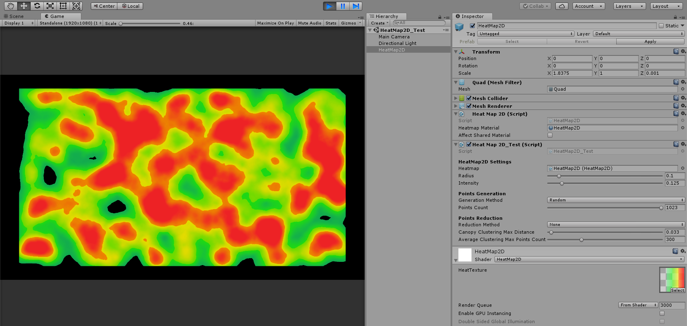

# HeatMap2D allows you to draw Heatmaps in Unity3D with the following advantages :
- Efficient shader code
- Huge amount of points never drops rendering performance
- A complete test scene to understand the provided algorithms

# System requirements
Developed with Unity3D 2017.4.35f1 for Windows target platform.